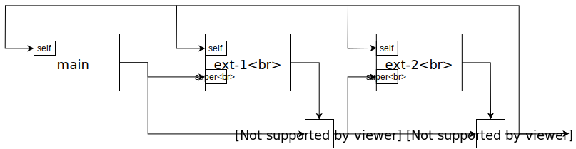
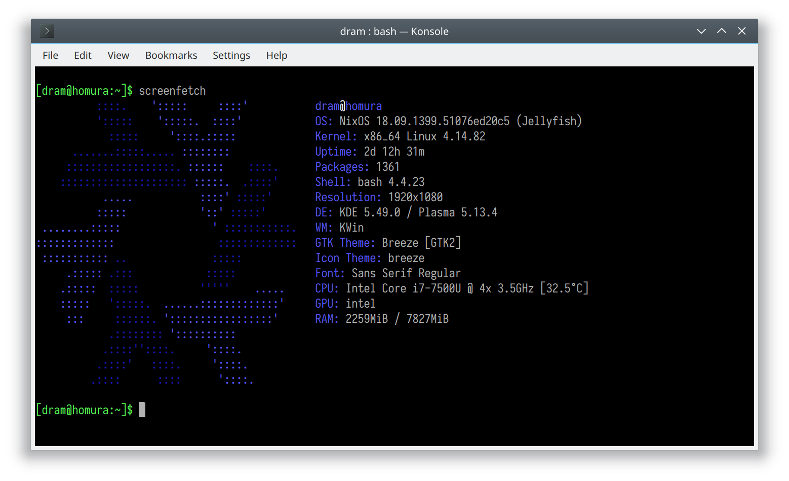

# Nix

*The purely functional package manager*

dram 2018-12-08

---

## Nix*

- Nix
- <!-- .element: class="fragment fade-out" data-fragment-index="0" -->
  Hydra
- Nixpkgs
- <!-- .element: class="fragment fade-out" data-fragment-index="0" -->
  NixOS
- <!-- .element: class="fragment fade-out" data-fragment-index="0" -->
  NixOps
- <!-- .element: class="fragment fade-out" data-fragment-index="0" -->
  Disnix

Notes:

Nix is the basis of a series of utilities.

Today we're going to focus on Nix the package manager itself and the package distribution Nixpkgs.

---

## Package management

- `pacman`
- `apt`
- `cabal`
- `cargo`
- `pip`
- &hellip;

---

## Typical package management

- <!-- .element: class="fragment" -->
  `pacman -S <foo>`
- <!-- .element: class="fragment" -->
  Download `foo` from index
- <!-- .element: class="fragment" -->
  Copy files
  - <!-- .element: class="fragment" -->
    `/usr`: Distribution `$PREFIX`
  - <!-- .element: class="fragment" -->
    `/usr/bin/python`, `/usr/lib/libncurses.so`

Notes:

A typical package manager would install files to a global directory.

---

## I want more

- Reproducible
- Isolated
- Declarative
- Customizable

---

## Scenario

- Crash mid-upgrade
- <!-- .element: class="fragment" -->
  *Systemd* was left unusable
- <!-- .element: class="fragment" -->
  Good luck
- <!-- .element: class="fragment" -->
  Needed: **Atomicity**

---

## Scenario

- Dependency hell
- Can't install `libfoo-5.3` and `libfoo-5.4` together
  - Say, conflicting files `/usr/lib/libfoo.so`
- <!-- .element: class="fragment" data-fragment-index="0" -->
  Bar requires `libfoo-5.3`, Baz requires `libfoo-5.4`
- <!-- .element: class="fragment" data-fragment-index="0" -->
  Can't install both Bar and Baz.

Notes:

Example: Upgrading kernel version means that old kernel modules are overriden with new ones and cannot be loaded anymore. Needs hacks to work around this (tmpfs?).

---

## Scenario

- Dependency hell
- “每次 Python 第二版本号升级我都要忙活一阵” (TUNA chat)
- <!-- .element: class="fragment" -->
  <u>If I just want to install two separate Python programs, I shouldn't care that they depend on different versions of Python.</u>
- <!-- .element: class="fragment" -->
  Needed: **Isolation** of packages, esp. dependencies
- <!-- .element: class="fragment" -->
  Identical deps should still be sharable

---

## Nix

> Nix is a powerful package manager [&hellip;] that makes package management reliable and reproducible. (https://nixos.org/nix)

```console
$ curl https://nixos.org/nix/install | sh
```

---

## Rest of this talk

- <!-- .element: class="fragment highlight-red" -->
  Using Nix packages
- Creating packages with Nix
- Customizing Nix packages
- Development environment

---

## Basic and imperative

| `nix-env ...` | `pacman ...` |
|-|-|
| `-iA nixpkgs.bat` | `-S bat` |
| `-e bat` | `-Rs bat` (1) |
| `-u bat` | `-Su bat` |
| `nix-channel --update` (2) | `-Syy` |

1. Dependencies don't automatically look installed to the user unless explicitly otherwise
2. `nix-channel` is orthogonal to `nix-env` and *optional*

Notes:

`nix-env` emulates a traditional imperative package manager, with similar interface, implementing install, erase, upgrade. Updating is done using another orthogonal mechanism and is thus from a different command.

---

## What's in a Nix package

```console
$ nix-env -iA nixpkgs.bat  # No need for root!
...
$ which bat
/home/dram/.nix-profile/bin/bat
$ readlink $(which bat)
/nix/store/a4him9701lkaaivdi0i3ffbpla829msp-bat-0.6.1/bin/bat
```

- <!-- .element: class="fragment" -->
  **Hashed** and **immutable**
  - Stored as readonly from day zero!

```console
$ ls -l /nix/store/a4him9701lkaaivdi0i3ffbpla829msp-bat-0.6.1/bin/bat 
-r-xr-xr-x 2 root root 5801848 Jan  1  1970 /nix/store/a4him9701lkaaivdi0i3ffbpla829msp-bat-0.6.1/bin/bat
```
<!-- .element: class="fragment" -->


Notes:

We can install a package as shown before. As you can see, the binary is put into a user-specifc directory as a symlink. The actual binary is stored in a special **hashed** and **immutable** path and stored **readonly**.

---

## What's in a Nix package

```console
/nix/store/a4him9701lkaaivdi0i3ffbpla829msp-bat-0.6.1
├── bin
│   └── bat
└── share
    └── man
        └── man1
            └── bat.1.gz

4 directories, 2 files
```

- <!-- .element: class="fragment" data-fragment-index="0" -->
  `bat` mini-prefix


```bash
--prefix=/nix/store/a4him9701lkaaivdi0i3ffbpla829msp-bat-0.6.1
```
<!-- .element: class="fragment" data-fragment-index="0" -->

Notes:

Once we list the files in this special path, it becomes apparent that it's a mini-prefix just for a single piece of software.

---

## Installing

Merging prefixes using symlinks

```console
$ nix-env -iA nixpkgs.screenfetch
...
$ tree ~/.nix-profile
/home/dram/.nix-profile
├── bin
│   ├── bat -> ...-bat-0.6.1/bin/bat
│   └── screenfetch -> ...-screenFetch-3.8.0/bin/screenfetch
├── manifest.nix -> ...-env-manifest.nix
└── share
    ├── doc -> ...-screenFetch-3.8.0/share/doc
...
```
<!-- .element: class="fragment" data-fragment-index="0" -->

- <!-- .element: class="fragment" data-fragment-index="1" -->
  Atomicity through copy-on-write

```console
$ realpath ~/.nix-profile
/nix/store/4zhpp40awamgf9fisxgqmi1619i2j7gk-user-environment
```
<!-- .element: class="fragment" data-fragment-index="1" -->

---

## Runtime dependencies

```console
$ ldd $(which bat)
        linux-vdso.so.1 (0x00007fffbf6bf000)
        libz.so.1 => /nix/store/bv6...-zlib-1.2.11/lib/libz.so.1 (0x00007f680eba9000)
        libc.so.6 => /nix/store/fg4...-glibc-2.27/lib/libc.so.6 (0x00007f680e7f5000)
        ...
```

- Immutable dependencies
- <!-- .element: class="fragment" -->
  Deps never break: `node_modules` but shared
- <!-- .element: class="fragment" -->
  Isolated: Two versions of zlib don't interfere

Notes:

We didn't see any dependencies of the software in `~/.nix-profile`. For example, glibc and zlib aren't actually 'installed'. Instead, the RUNPATH of binaries explicitly list all dependencies by their hashed paths.

At this point it's basically `node_modules` with sharing.

The same would go for shebang (`#!`) lines, path references etc.

---

## Isolation

- Isolation by immutability
- <!-- .element: class="fragment" -->
  Virtual machine: Isolation at CPU
- <!-- .element: class="fragment" -->
  Container: Isolation at kernel
- <!-- .element: class="fragment" -->
  Nix: Isolation at userland

<!-- .element: class="fragment" --> (https://vimeo.com/223525975)


---

## <!-- .element: class="fragment" --> Nixpkgs

- Where do all those software come from?
- <!-- .element: class="fragment" -->
  **Derivation** &rarr; **Output**
- <!-- .element: class="fragment" -->
  The vast collection of software, utilities and more

Notes:

The name 'derivation' is in contrast to 'source', and represents a package to-be-built. 'Output' then refers to the build product or 'binary'.

Nixpkgs also has other utilities for packaging in different languages and also tools for Docker images, virtual machines and so on. It also supports cross-compilation.

---

## Progress

- Using Nix packages
- <!-- .element: class="fragment highlight-red" -->
  Creating and Building packages
- Customizing Nix packages
- Development environments

---

## Nix language

- Lazy functional
- Dynamic typed
- *Somewhat* purely-functional
- 'Sets'

```nix
{
  a = 1; 
  b = {
    x = 0;
  };
}
```

---

## Derivation

- Example: GNU Hello

```nix
{ stdenv, fetchurl }:

stdenv.mkDerivation rec {
  name = "hello-${version}";
  version = "2.10";

  src = fetchurl {
    url = "mirror://gnu/hello/${name}.tar.gz";
    sha256 = "0ssi1wpaf7plaswqqjwigppsg5fyh99vdlb9kzl7c9lng89ndq1i";
  };
}
```

Notes:

`stdenv` is a wrapper around the common `./configure && make && make install`

Contains a hook mechanism for things like CMake.

---

## Derivation

- Example: `bat`

```nix
{ stdenv, fetchFromGitHub, rustPlatform   # Utilities
, cmake, pkgconfig, zlib, libiconv  # Dependent derivations
}:

rustPlatform.buildRustPackage rec {
  name    = "bat-${version}";
  # Build-time deps
  nativeBuildInputs = [ cmake pkgconfig zlib ];
  # Runtime deps to 'link' in
  buildInputs = [ libiconv ];
  # The two are separated to facilitate cross-compilation
  ...
}
```

---

## Building

```console
$ nix-build -E '(import <nixpkgs> {}).callPackage ./hello.nix {}'
```
<!-- .element: class="fragment" data-fragment-index="0" -->

```console
$ cat default.nix
(import <nixpkgs> {}).callPackage ./hello.nix {}
$ nix-build
```
<!-- .element: class="fragment" data-fragment-index="1" -->

---

## Building

```console
$ nix-build -E '(import <nixpkgs> {}).callPackage ./hello.nix {}'
these derivations will be built:
  /nix/store/sc0y084gglb92gz79nsgjcp4q0i7sh70-hello-2.10.drv
building '/nix/store/sc0y084gglb92gz79nsgjcp4q0i7sh70-hello-2.10.drv'...
unpacking sources
...
checking whether build environment is sane... yes
...
/nix/store/rgbrg1zizqi9iq0zjrdx86jp2rq03syh-hello-2.10
$ readlink ./result # Output symlink
/nix/store/rgbrg1zizqi9iq0zjrdx86jp2rq03syh-hello-2.10
$ ls result
bin  share
```

---

## Building

- <!-- .element: class="fragment" -->
  `hello.nix`
- <!-- .element: class="fragment" -->
  Evaluate &rarr; Derivation: `sc0...-hello-2.10.drv`
- <!-- .element: class="fragment" -->
  Build &rarr; Output: `rgb...-hello-2.10`
- <!-- .element: class="fragment" -->
  Output path is determined by derivation hash and not output hash.

Notes:

Output path is determined by derivation hash and not output hash so that outputs can have references to themselves, and we can also do binary distribution.

Actually, if the output path is unknown prior to building, where do we set `--prefix` to?

---

## Building

- <!-- .element: class="fragment" -->
  Build time deps: only explicit deps are available
  - Tracked in `.drv`
- <!-- .element: class="fragment" -->
  Result: **Reprodicibility**
- <!-- .element: class="fragment" -->
  (Name of Nix: Dutch *niks* meaning 'nothing')
- <!-- .element: class="fragment" -->
  (Runtime: Find store paths in file contents)

Notes:

Name of Nix: Dutch *niks* meaning 'nothing'. Builders see nothing in the dirty outside environment

Runtime deps: Search hash part of store path in file contents, like a conservative garbage collector.

---

## Binary distribution

- Builder side:
- <!-- .element: class="fragment" data-fragment-index="0" -->
  Archive and upload: (Approximation)

```console
$ mkdir binary-cache
$ nix copy --to file://binary-cache /nix/store/rgb...-hello-2.10
$ nix copy --to s3://nix-cache /nix/store/rgb...-hello-2.10
```
<!-- .element: class="fragment" data-fragment-index="1" -->

- <!-- .element: class="fragment" data-fragment-index="2" -->
  `rgb....narinfo` &xlarr; `/nix/store/rgb...`
- <!-- .element: class="fragment" data-fragment-index="2" -->
  `nar/09z....nar.xz` &xlarr; Hash of file itself

Notes:

The build farms uploads build outputs to S3.

`https://cache.nixos.org` is a Fastly CDN over `https://nix-cache.s3.amazonaws.com`

---

## Binary distribution

- User side:
- <!-- .element: class="fragment" -->
  Same expression
- <!-- .element: class="fragment" -->
  Same derivation: `sc0...-hello-2.10.drv`
- <!-- .element: class="fragment" -->
  Download pre-built: `rgb...-hello-2.10`
- <!-- .element: class="fragment" -->
  Download dependencies
- <!-- .element: class="fragment" -->
  Result: **Source distro with binaries as optimization**

---

## Progress

- Using Nix packages
- Creating packages with Nix
- <!-- .element: class="fragment highlight-red" -->
  Customizing Nix packages
- Development environment

---

## Customization support in Nixpkgs

- Configuration options
- Dependency injection
- Flexibility of source distro with reduced cost

---

## `override`

- Overriding configuration
- <!-- .element: class="fragment" data-fragment-index="0" -->
  Example: Static Musl `busybox`

```nix
busybox.override {
  enableStatic = true;
  useMusl = true;
}
```
<!-- .element: class="fragment" data-fragment-index="0" -->

---

## `override`

- Overriding derivation dependencies
- <!-- .element: class="fragment" data-fragment-index="0" -->
  Example: `boost` with Python 3

```nix
boost.override {
  python = python3;
}
```
<!-- .element: class="fragment" data-fragment-index="0" -->

---

## Overlays

- <!-- .element: class="fragment" data-fragment-index="0" -->
  `~/.config/nixpkgs/overlays/foo.nix`

```nix
self: super:
{
  sarasa-gothic = self.callPackage ./sarasa-gothic.nix {};

  boost = super.boost.override {
    python = self.python3;
  };
}
```
<!-- .element: class="fragment" data-fragment-index="0" -->

Notes:

Overlays essentially adds or replaces packages in Nixpkgs when you use `nix-env`. These would have different derivation hashes, so you will need to build them and their dependents from source.

---

## Overlays

- Like class-based inheritance

```java
class Mypkgs extends Nixpkgs {
  Derivation boost() {
    return super.boost().override(python=this.python3);
  }
}
```



---

## Nix language

- <!-- .element: class="fragment" -->
  Expressing Nixpkgs requires a higher-than-Bash level language
  - Involves higher-order functions
- <!-- .element: class="fragment" -->
  Was a **new** language needed?
  - What do you think?
  - See also: Guix which uses Guile

Notes:

自主可控

---

## Progress

- Using Nix packages
- Creating packages with Nix
- Customizing Nix packages
- <!-- .element: class="fragment highlight-red" -->
  Development environment

---

## `nix-shell`

```console
$ nix-shell -E '(import <nixpkgs> {}).callPackage ./hello.nix {}'
[nix-shell]$ unpackPhase
...
[nix-shell]$ ls
hello-2.10
[nix-shell]$ cd $sourceRoot # sourceRoot=hello-2.10
[nix-shell]$ configurePhase
configure flags: --prefix=/nix/store/rgbrg1zizqi9iq0zjrdx86jp2rq03syh-hello-2.10
checking for a BSD-compatible install... /nix/store/wm8va53fh5158ipi0ic9gir64hrvqv1z-coreutils-8.29/bin/install -c
checking whether build environment is sane... yes
...
```

---

## `nix-shell`

- <!-- .element: class="fragment" -->
  Just replicates the build environment
- <!-- .element: class="fragment" -->
  Isolated (like `~/.nix-profile`)
- <!-- .element: class="fragment" -->
  Similar to
  - `apt build-depends`
  - RVM, Pipenv
  - Docker

---

## Documentation

- https://nixos.org/nix/manual
- https://nixos.org/nixpkgs/manual

---

## Thanks. Questions?


