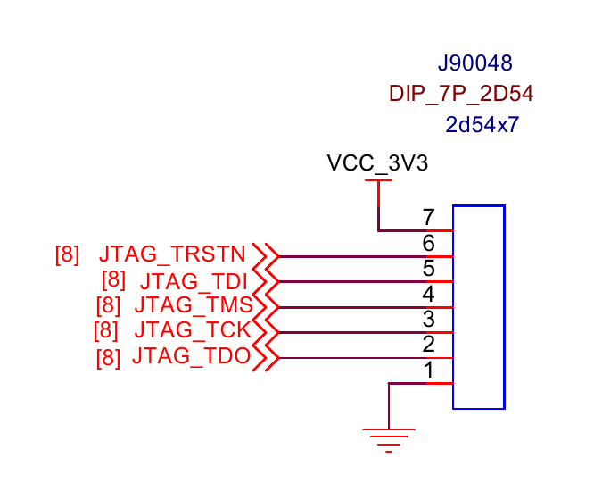
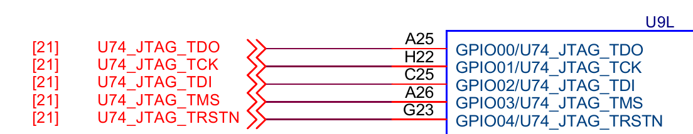
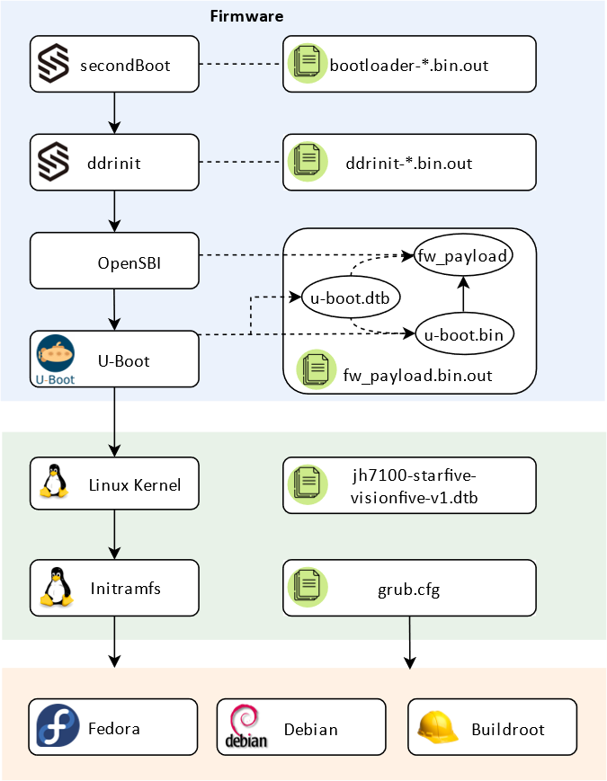
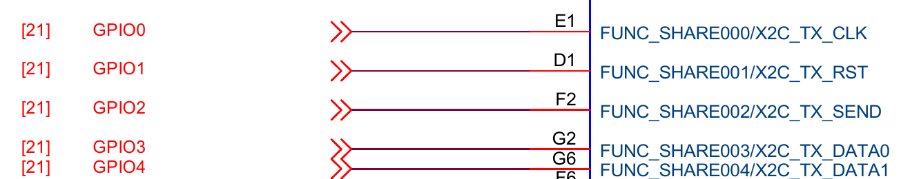
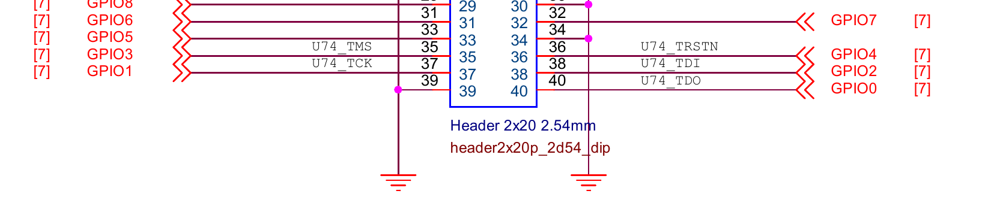
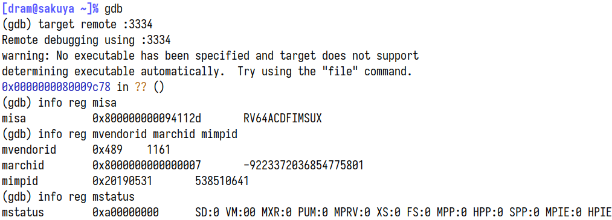

```{=html}
<!DOCTYPE html>
<html>

<head>
    <title>VisionFive JTAG adventures, Part 1: JH7100 GPIO -- dramforever</title>
    <meta charset="utf-8">
    <meta name="viewport" content="width=device-width, initial-scale=1">
    <link rel="stylesheet" href="../../styles/default.css">
    <link rel="stylesheet" href="../../styles/post.css">
    <script type="text/javascript" async src="https://cdnjs.cloudflare.com/ajax/libs/mathjax/2.7.1/MathJax.js?config=TeX-MML-AM_CHTML"></script>
</head>

<body>

<div id="site-title">
    <h1 id="site-title-main"><a href="/">
        dramforever
    </a></h1>
    <div id="site-title-sub">a row of my life</div>
</div>

<article>
<div id="post-title">
    <h1 id="post-title-main">VisionFive JTAG adventures, Part 1: JH7100 GPIO</h1>
    <span id="post-title-sub">2022-06-27</span>
</div>
```

## Background

The research that went into this article began as a simple technical question: How do I connect to the JTAG debug port on the VisionFive?

When luojia [asked this very question][luojia-rvspace] on the support forum, the only responses were, surprisingly, discouragement. However, for any low-level software development, such a debug port is pretty much the only way to sanely, well, debug anything at all. Even though `printf` debugging was technically possible, it is still worth it to see if we can reach it over JTAG, given that the board is supposed to have JTAG connectors.

[luojia-rvspace]: https://forum.rvspace.org/t/jtag-visionfive/354

## VisionFive

The development board in question, [VisionFive][visionfive], is a RISC-V single-board computer from StarFive. At its core is a StarFive JH7100 SoC, with two SiFive U74 cores and one E24 core.

[visionfive]: https://rvspace.org/en/Product/VisionFive/Technical_Documents/VisionFive_Single_Board_Computer_Quick_Start_Guide

*(As of writing, the version of VisionFive currently available is also known as 'VisionFive V1', though even official documentation often omits the version number. The name 'VisionFive' in this article consistently refers to VisionFive V1, in case confusion arises in the future.)*

The same processor core is also found on the [HiFive Unmatched][unmatched], on which the main SoC has four U74 cores and one S7 core. Unmatched had more RAM and better peripherals, and was made in the form factor of a regular PC motherboard. VisionFive is, instead, clearly intended for a slightly lower end market, or for those who prefers a palm-sized Raspberry Pi lookalike.

[unmatched]: https://www.sifive.com/boards/hifive-unmatched

## JTAG on the VisionFive, or not

For our purposes, the one main difference between the Unmatched and the VisionFive is how the JTAG port is connected. On the Unmatched, an FT2322H adapter on-board means that the Micro-USB port gives access to both the UART port and the JTAG port, readily usable with [riscv-openocd].

[riscv-openocd]: https://github.com/riscv/riscv-openocd

On the VisionFive, however, JTAG access seems... elusive. Nowhere in the documentation is the JTAG port on-board mentioned. On drawings of the board, the words JTAG are written next to the PMIC, which is, at least to me, nonsensical, as there are no notable ports to be found there.


Next to the color-coded (nice!) 40-pin header though, one can find seven plated holes, one of them having a square outline. Browsing through the schematic reveals that this is indeed where the JTAG port is connected.



Problem solved, right? Solder up some header pins or build a pogo-pin rig, and just connect it up to your workstation with an FT2322H, and we have JTAG.

Or so we thought. Unfortunately, this JTAG ports does not seem to respond at all to any input. It seems as if this port isn't connected at all.

## Finding the JTAG port

Chasing through labels on the schematics reveals that the `JTAG_*` through-holes connect to a level shifter, which presents the SoC with 1.8&nbsp;V signals instead of 3.3&nbsp;V ones. They then connect to pads on the SoC, mysteriously named `GPIOxx/U74_JTAG_*`.



So are these GPIO or JTAG? Thankfully the pad connections have labels with positions, so we can look them up on the datasheet. For example, `A25` is described as...

```
A25     GPIO[0]     IO      function IO share with GPIO
```

'Function IO Share' is the title of section 11 in the datasheet. One register, named `IO_PADSHARE_SEL`, has one of 7 valid values, 0 through 6, is a global configuration controlling the functions two-hundred-odd pads `PAD_FUNC_SHARE[141:0]` and `PAD_GPIO[63:0]`. Each of the configurations is called a 'signal group', and the groups themselves are called 'Function 0' through 'Function 7'. A giant table then follows, showing each pad's function under each signal group.

The pads `PAD_GPIO[4:0]` would be the connections we found earlier, and in Function 0, they. Since Function 0 is supposed to be the default value on reset, this means that we should see a JTAG port there, right?

At this point, the only thing I could think of is connecting to JTAG while holding down the reset button. However, since I had neither a JTAG adapter nor a VisionFive board, all I did was tell luojia about it, and moved on to finish my finals.

## Digging deeper into the GPIO multiplexer

The single document that made the system 'click' for me is the devicetree documentation for `starfive,jh7100-pinctrl`. This node can be found in `jh7100.dtsi`, which is included in `jh7100-starfive-visionfive-v1.dts`:

```dts
gpio: pinctrl@11910000 {
    compatible = "starfive,jh7100-pinctrl";
    reg = <0x0 0x11910000 0x0 0x10000>,
          <0x0 0x11858000 0x0 0x1000>;
    reg-names = "gpio", "padctl";
    /* <snip> */
};
```

The address ranges mentioned here correspond to these rows in the datasheet:

```
SYSCTRL-IOPAD_CTRL  0x00_1185_8000  0x00_1185_BFFF  16KB
GPIO                0x00_1191_0000  0x00_1191_FFFF  64KB
```

These registers control the functions and states of `PAD_GPIO[63:0]` and `PAD_FUNC_SHARE[141:0]`. The following diagram is included in the devicetree bindings documentation:

```
                          Signal group 0, 1, ... or 6
                                 ___|___
                                |       |
    LCD output -----------------|       |
    CMOS Camera interface ------|       |--- PAD_GPIO[0]
    Ethernet PHY interface -----|  MUX  |--- PAD_GPIO[1]
      ...                       |       |      ...
                                |       |--- PAD_GPIO[63]
     -------- GPIO0 ------------|       |
    |  -------|-- GPIO1 --------|       |--- PAD_FUNC_SHARE[0]
    | |       |   |             |       |--- PAD_FUNC_SHARE[1]
    | |       |   |  ...        |       |       ...
    | |       |   |             |       |--- PAD_FUNC_SHARE[141]
    | |  -----|---|-- GPIO63 ---|       |
    | | |     |   |   |          -------
    UART0     UART1 --
```

These pads on the package, or 'function IO share with GPIO' as listed in the datasheet, are connected to the internal signals through a *two*-stage multiplexer:

First, as mentioned, the `IO_PADSHARE_SEL` register selects one of 7 'signal groups'. This is, curiously, a global setting, meaning that it affects *all* of the 'function share' pads at once. A huge table in the datasheet describes the function of each such pad's function in each signal group. For example, the row in the table for `PAG_GPIO[0]` reads: (Reproduced here vertically for convenience)

```
Interface               GPIO
IO Name                 PAD_GPIO[0]
Function 0 (Default)    U74_JTAG_TDO
Function 1              GPIO0
Function 2              X2C_TX_DATA3
Function 3              LCD_DATA4
Function 4              X2C_TX_DATA3
Function 5              PLL_RFSLIP[0]
Function 6              MIPITX_MPOSV[0]
```

Note that `GPIOn` has no direct correspondence to `PAD_GPIO[n]`. For example, `PAD_FUNC_SHARE[0]` can also be connected to `GPIO0`:

```
Interface               ChipLink
IO Name                 PAD_FUNC_SHARE[0]
Function 0 (Default)    X2C_TX_CLK
Function 1              LCD_CLK
Function 2              CM_CLK
Function 3              X2C_TX_CLK
Function 4              GPIO0
Function 5              GPIO0
Function 6              GPIO0
```

Instead, `GPIOn` are internal signals further multiplexed into internal inputs and outputs by the 'GPIO FMUX'. Each of the `GPIOn` signals also has configurable pull up/down and Schmitt triggers, though not all options are available for all I/O pads.

After that, there are three connections to be made: output, output enable, and input. These are all configured from the destination side, so:

- Each GPIO output and output enable may be connected to either one of the internal outputs or a constant `0` or `1`.
- Each internal input may be connected to one of the GPIO inputs, or a constant `0` or `1`.

In addition, the input value from each GPIO may be read from MMIO registers `GPIODIN_0` and `GPIODIN_1`, and it's also possible to configure them to fire interrupts.

This allows quite a flexible usage of the GPIO internal signals. They can be selected to work with the 1.8&nbsp;V or 3.3&nbsp;V I/O pads, and can either be fully controlled by software with interrupt support, or connected to one of the internal I2C/I2S/SDIO/... controllers.

Curiously, in Function 0, the default mode for `IO_PADSHARE_SEL`, *none* of the GPIOn signals are connected to the I/O pads. Instead, some of the internal signals are directly connected to I/O pads. Moreover, in a few of the cases, the internal signals `PAD_GPIO[n]` connects to in Function 0 are conveniently also by default connected to the same-numbered internal `GPIOn`. For example, most relevant to our original use cases, in Function 0 these connections are made:

```
PAD_GPIO[0]         U74_JTAG_TDO
PAD_GPIO[1]         U74_JTAG_TCK
PAD_GPIO[2]         U74_JTAG_TDI
PAD_GPIO[3]         U74_JTAG_TMS
PAD_GPIO[4]         U74_JTAG_TRSTN
```

At the same time, the default GPIO FMUX configuration for these JTAG signals are:

```
CPU_JTAG_TDO        GPIO0
CPU_JTAG_TCK        GPIO1
CPU_JTAG_TDI        GPIO2
CPU_JTAG_TMS        GPIO3
CPU_JTAG_TRSTN      GPIO4
```

(It seems that `CPU_JTAG_*` are synonymous with `U74_JTAG_*`.)

## Finding the JTAG port, take two

It seems that Function 0 is intended for booting and initialization, with many of the internal functions available on I/O pads right away without configuration. However given the lack of, well, actual general purpose input/output, there is no chance Linux runs in Function 0.

We already see our problem: The seven through-holes going to `PAD_GPIO[4:0]` are JTAG in Function 0 but might not be when another 'Function' is selected. This means that at some time after booting, `IO_PADSHARE_SEL` is set from `0` to some other value, and these JTAG-appearing through-holes would no longer be JTAG.

Which value is it then? Curiously, the example listed in the devicetree documentation has this property:

```
starfive,signal-group = <6>;
```

Which would suggest that Linux selects Function 6 at initialization, though the actual `jh7100.dtsi` did not have this property. The documentation indicates that in case the property is not specified, the `IO_PADSHARE_SEL` register is left unchanged:

```yaml
starfive,signal-group:
  description: |
    Select one of the 7 signal groups. If this property is not set it
    defaults to the configuration already chosen by the earlier boot stages.
  $ref: /schemas/types.yaml#/definitions/uint32
  enum: [0, 1, 2, 3, 4, 5, 6]
```

After a short chat with luojia, who tried connecting to JTAG without a microSD card unsuccessfully, it is apparent that some earlier boot stage sets `IO_PADSHARE_SEL`. It did not take long crawling through the code provided by StarFive to find [this particular line in secondBoot][secondboot-set-padshare]:

[secondboot-set-padshare]: https://github.com/starfive-tech/JH7100_secondBoot/blob/bootloader-211102_VisionFive_JH7100/boot/bootmain.c#L179

```c
_SET_SYSCON_REG_register104_SCFG_io_padshare_sel(6);
```

For those not familiar with secondBoot, it is one of the first stages of bootloaders on the VisionFive, second to only the internal ROM.



All of the 'Firmware' stages run from an on-board QSPI flash, without requiring a microSD card present. This means that early on in the boot sequence, `IO_PADSHARE_SEL` is switched from `0` to `6`, disabling the JTAG through-holes. Searching through the other files in this repository also reveals the undocumented address of `IO_PADSHARE_SEL`:

```
0x118581a0
```

There is still a way to confirm `IO_PADSHARE_SEL`. If you hold down the 'Boot mode' button while powering the board up, instead of following the normal boot process, a prompt appears on the 'debug' serial console port at 9600 8n1, running off internal ROM, where you can read and write arbitrary physical memory. At this point, NickCao helped me out by connecting to this 'recovery console', and reading `IO_PADSHARE_SEL`:

```
# rh 0x118581a0

 Read Half : 0x0000
```

Reading the same address in the U-Boot shell gives `6`, confirming much of what we had seen.

## Connecting to JTAG, for the first time

But wait, if `IO_PADSHARE_SEL` is `0` when running in internal ROM, does this mean JTAG *is* available on the seven through-holes? Should we be able to connect to the debug modules in this state?

I asked Icenowy, the only person I know of with both a VisionFive and some JTAG adapter handy to help out. I told them to power up the board with 'Boot mode' button held down, and *then* try connecting to JTAG. They came back with what was, at the time of writing, the first screenshot of GDB-over-OpenOCD connected to the JH7100, at least from what I could find on the Internet.


Among the addresses found in the registers are:

- `0x1840084c`: Middle of internal ROM
- `0x1800ff80`: Middle of intRAM0
- `0x1244000c`: One of the UART3 registers

Finally, we have JTAG access to the VisionFive.

## Finding the JTAG port, take three

Even though technically we're connected to the debug module, running the SoC entirely in Function 0 isn't really an option as the board doesn't seem to be configured this way. Once we switch to Function 6 though, our connection would be cut off.

Where do the JTAG signals now go go? As mentioned earlier, the JTAG signals are mapped by default to `GPIO0` through `GPIO4`. Since we're now in Function 6, these GPIO signals correspond to I/O pads... (looks at datasheet) `PAD_FUNC_SHARE[4:0]`, which are 3.3&nbsp;V and connected on the schematic to nets confusingly named `GPIO0` through `GPIO4`.



These nets are connected to the 40-pin Raspberry Pi compatible header at pins... Wait what?



For some reason, these pins are labelled on the schematic with JTAG signal names. On any other documentation, such as [StarFive's GPIO Header Guide][starfive-gpio-guide], they are only referred to as `GPIO0`, etc. and nowhere is JTAG mentioned.

[starfive-gpio-guide]: https://rvspace.org/Product/General/StarFive_40-Pin_GPIO_Header_User_Guide

A straightforward test of connecting the JTAG adapter while the system is up and running showed that these five pins... do not respond to the JTAG adapter.

Confusingly, Icenowy found out that for a certain period during the boot process, they *could* connect through those pins on the 40-pin header. Before this period, JTAG is found on the seven through-holes, and after that, it just seems to... disappear. Perhaps somewhere in the boot process another piece of code configured the second-stage GPIO FMUX and disconnected the JTAG signals. It makes sense because it frees up five pins on the header for actual GPIO.

## Finding the JTAG port, take four

Around the same time when I asked NickCao to confirm the value of `IO_PADSHARE_SEL` in U-Boot, I also asked them to check the GPIO FMUX configuration, which showed that JTAG signals are connected correctly to `GPIO0` through `GPIO4`. Therefore, whatever changed the configuration must have come after. Linux it is.

As mentioned before, the devicetree node `starfive,jh7100-pinctrl` manages both layers of GPIO multiplexing. The driver itself can be found in `drivers/pinctrl/pinctrl-starfive.c`.

Initially, I had assumed that the driver in StarFive's fork of Linux was identical to that found in mainline Linux 5.18, though I would soon be proven wrong. As I was browsing through the dts files hoping to gain some insight on why the JTAG signals were gone, a section in `jh7100-starfive-visionfive-v1.dts` caught my eye.

```dts
&gpio {
	/* don't reset gpio mux for serial console and reset gpio */
	starfive,keep-gpiomux = <13 14 63>;
};
```

There was no mention of `starfive,keep-gpiomux` in mainline Linux's version of `pinctrl-starfive`, but these two lines in StarFive's version seemed relevant.

```c
if (!keepmux)
    starfive_pinmux_reset(sfp);
```

`keepmux` is a module option defined as:

```c
static bool keepmux;
module_param(keepmux, bool, 0644);
MODULE_PARM_DESC(keepmux, "Keep pinmux settings from previous boot stage");
```

`starfive_pinmux_reset` disables the inputs and outputs associated with every `GPIOn` signal, unless `n` was mentioned in `starfive,keep-gpiomux`.

The next step was clear: Boot with the kernel command line option `pinctrl-starfive.keepmux=1`, or modify `jh7100-starfive-visionfive-v1.dts` and add the JTAG signals to `starfive,keep-gpiomux`:

```c
	starfive,keep-gpiomux = <0 1 2 3 4 13 14 63>;
```

## Connecting to VisionFive with OpenOCD

At this point I borrowed the board from NickCao, and used a Raspberry Pi as an adapter to connect to it, over the JTAG pins on the 40-pin connector. Two TAPs can be found on the JTAG port, the first of which connects to the E24 core, and the second connects to the two U74 cores. This was my OpenOCD configuration file:

```tcl
adapter driver linuxgpiod

linuxgpiod gpiochip 0
linuxgpiod jtag_nums 11 25 10 9
linuxgpiod trst_num 7

reset_config trst_only

transport select jtag

jtag newtap e24 cpu -irlen 5 -expected-id 0x200005fd
jtag newtap u74 cpu -irlen 5 -expected-id 0x200003fd

target create e24.cpu0 riscv -chain-position e24.cpu -coreid 0
target create u74.cpu0 riscv -chain-position u74.cpu -coreid 0 -rtos hwthread
target create u74.cpu1 riscv -chain-position u74.cpu -coreid 1
target smp u74.cpu0 u74.cpu1

init
```

Before Linux boots, I was able to connect to all of these cores, and read some information off of them. For example, reading CSRs from the U74 cores:



As expected, this is a SiFive (`mvendorid = 0x489`) 7-series (`marchid = (1 << 63) | 7`) core, version 19.05 (`mimpid = 0x20190531`). Seen from the ISA implemented, namely `RV64GC` with Supervisor/User, this was certainly a U74 core.

After Linux starts, however, the E24 core seems to start misbehaving. OpenOCD starts generating error messages like:

```
Warn : target e24.cpu0 examination failed
Error: [e24.cpu0] DMI operation didn't complete in 2 seconds. The target is either really slow or broken. You could increase the timeout with riscv set_command_timeout_sec.
```

It seems that the E24 core had been disconnected or disabled. In any case, it was not responding. OpenOCD was confused by this lack of response and debugging on the U74 was also affected:


Commenting out the `e24.cpu0` line in the config would ignore the E24 core and work around this issue.

```tcl
# target create e24.cpu0 riscv -chain-position e24.cpu -coreid 0
```

What is going on with the E24 core? Seeing that the main star of the show, the dual U74 cores, have already been 'conquered', it's probably an appropriate time to take a break. This article has already been filled with too many details, so we will look at the E24 'microcontroller' core next time, as a side quest, in a future post.

(By the way: It seems that beta/sample versions of the now cancelled BeagleV Starlight board has a very similar JTAG configuration. If anyone still has one of these boards, it would be extremely interesting to try it out.)

[beaglev-edk2]: https://github.com/riscv-collab/riscv-edk2-platforms/issues/15#issuecomment-839539127

*To be continued...*

## References

- JH7100 documentation: <https://github.com/starfive-tech/JH7100_Docs>
- VisionFive schematics: <https://github.com/starfive-tech/VisionFive>
- JH7100 'secondBoot' bootloader: <https://github.com/starfive-tech/JH7100_secondBoot>
- SiFive U74 Core Complex Manual: <https://sifive.cdn.prismic.io/sifive/ad5577a0-9a00-45c9-a5d0-424a3d586060_u74_core_complex_manual_21G3.pdf>
- Files found in VisionFive Linux source code, provided by StarFive:
    - [`include/dt-bindings/pinctrl/pinctrl-starfive.h`](https://github.com/starfive-tech/linux/blob/visionfive/include/dt-bindings/pinctrl/pinctrl-starfive.h)
    - [`drivers/pinctrl/pinctrl-starfive.c`](https://github.com/starfive-tech/linux/blob/visionfive/drivers/pinctrl/pinctrl-starfive.c)
    - [`Documentation/devicetree/bindings/pinctrl/starfive,jh7100-pinctrl.yaml`](https://github.com/starfive-tech/linux/blob/visionfive/Documentation/devicetree/bindings/pinctrl/starfive%2Cjh7100-pinctrl.yaml)
    - [`arch/riscv/boot/dts/starfive/jh7100.dtsi`](https://github.com/starfive-tech/linux/blob/visionfive/arch/riscv/boot/dts/starfive/jh7100.dtsi)
    - [`arch/riscv/boot/dts/starfive/jh7100-starfive-visionfive-v1.dts`](https://github.com/starfive-tech/linux/blob/visionfive/arch/riscv/boot/dts/starfive/jh7100-starfive-visionfive-v1.dts)

I made a post to StarFive's RVSpace forum with a how-to of connecting to VisionFive's JTAG port, hoping it would help those looking to do low-level work on the board: <https://forum.rvspace.org/t/connecting-to-visionfive-s-jtag-port-a-short-guide/514>.

## Acknowledgements

I would like to thank these people for helping out during the research:

- NickCao (GitHub: [@NickCao](https://github.com/NickCao))
- luojia (GitHub: [@luojia65](https://github.com/luojia65))
- Icenowy (GitHub: [@Icenowy](https://github.com/Icenowy))

## About this document

This document was generated using [Pandoc][pandoc] from [the Markdown source](visionfive-jtag-1.md):

[pandoc]: https://pandoc.org/

```console
$ pandoc -f markdown -t html < visionfive-jtag-1.md > index.html
```

```{=html}
</body>
</html>
```
