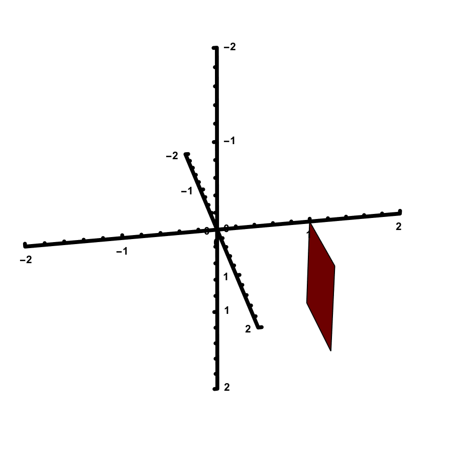
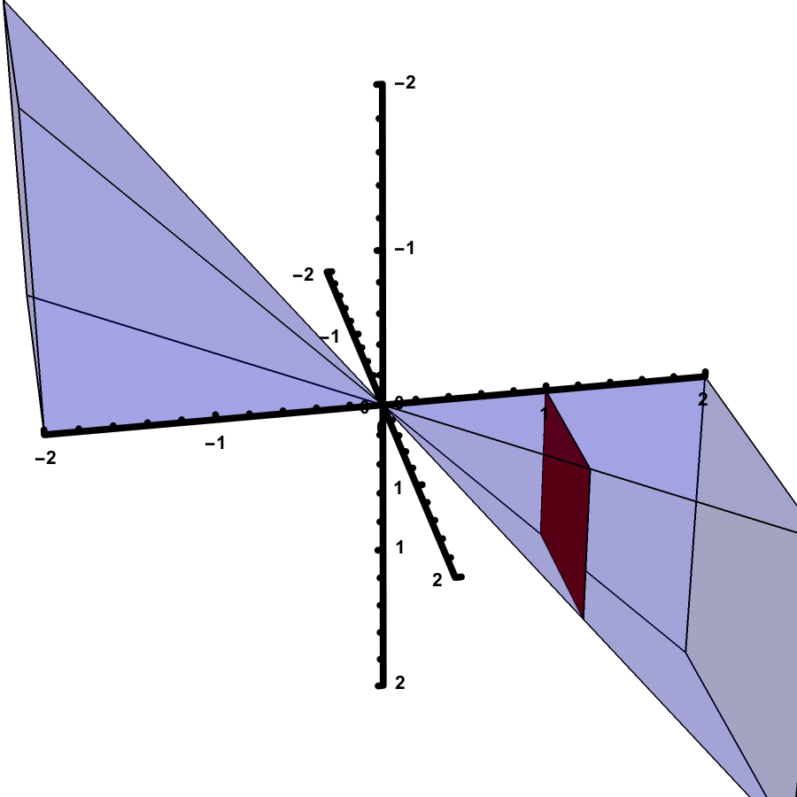
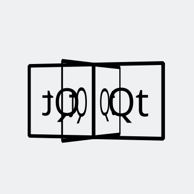
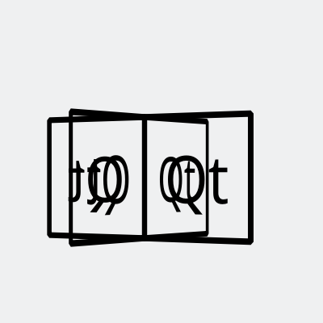

# Qt 中的坐标变换

计算机系 王瑞康 2018011301

2018-08-29

---

# 坐标

- <!-- .element: class="fragment" data-fragment-index="0" -->
  `QPoint` 和 `QPointF` 表示点或向量
- <!-- .element: class="fragment" data-fragment-index="0" -->
  建议：`QPoint` 网格，`QPointF` 图形
- <!-- .element: class="fragment" data-fragment-index="1" -->
  `QPointF(x, y)` 表示点 `$ (x, y) $`
- <!-- .element: class="fragment" data-fragment-index="1" -->
  `x()` 和 `y()`

Notes:

- `QPoint` 和 `QPointF` 内部分别是用整数和浮点数表示的坐标
- 支持简单的向量运算，如加减、数乘、点乘
- 推荐在网格上用坐标的时候用 `QPoint`，在和实际位置有关的时候用 `QPointF`
- `QPoint` 可以自动转成 `QPointF`，反之不行

---

# Qt 坐标系

- `QRectF(QPoint(1., 2.), QPointF(7., 6.))`
- `QRectF(QPoint(1., 2.), QSizeF(6., 4.))`
- `QRectF(1., 2., 6., 4.)`


Notes:

Qt 的坐标系大家应该不陌生，我们可以看一下这里给出的 `QRectF` 的构造的三种不同的方式

---

# Qt 坐标系

- 原点在左上角，`$x$` 轴朝右，`$y$` 轴朝**下**
- <!-- .element: class="fragment" data-fragment-index="0" -->
  推论：旋转时正角是**顺时针**

---

## 线性代数复习

- <!-- .element: class="fragment" data-fragment-index="0" -->
  仿射 (affine) 变换（线性变换加平移）的一般形式：

`$$
\begin{cases}
x_1 = m_{11} x_0 + m_{21} y_0 + \Delta x \\
y_1 = m_{22} y_0 + m_{12} x_0 + \Delta y
\end{cases}
$$`
<!-- .element: class="fragment" data-fragment-index="1" -->

Notes:

- 我们来进入线代复习环节

---

## 线性代数复习

- `$(x, y) \mapsto (x, y, \color{red}{1})$`
- <!-- .element: class="fragment" data-fragment-index="0" -->
  矩阵形式

`$$ (x_1, y_1, \color{red}{1}) = (x_0, y_0, \color{red}{1}) \begin{bmatrix} m_{11} & m_{12} & \color{red}{0} \\ m_{21} & m_{22} & \color{red}{0} \\ \Delta x & \Delta y & \color{red}{1} \end{bmatrix} $$`
<!-- .element: class="fragment" data-fragment-index="0" -->


Notes:

- 我们在坐标中加入一个新的分量 `z`，它永远是 `1`
- 这样我们就可以给坐标向量只右乘一个矩阵来完成一个仿射变换，这个矩阵的最右列一定是 `0, 0, 1`

---

## <!-- .element: class="fragment" data-fragment-index="1" -->  `QTransform` 类的使用

- <!-- .element: class="fragment" data-fragment-index="0" -->
  之前的数学形式无需记忆
- <!-- .element: class="fragment" data-fragment-index="2" -->
  `QTransform` 类上的成员函数：
    - 变换：`translate(qreal, qreal)` 平移、`rotate` 旋转、`scale` 缩放 &hellip;
        - `QTransform` 的动词成员函数**对绘制的图形操作**，而不是坐标系
    - 分量：`m11()` &hellip;
    - 线代 <del>PTSD</del>：`inverted()` 逆，`adjoint()` 伴随、`determinant()` 行列式

Notes:

- 我刚刚给的这些数学形式无需记忆，但是我后面说的和它有关，希望可以帮助大家理解。
- 实际使用的时候，我们一般是调用 `QTransform` 类上的成员函数来操作变换

---

## `QTransform` 类的使用

```c++
QTransform tr; // 新建单位变换

tr.scale(40, 40); // 修改
tr.translate(1.5, 1.5);

QPointF(/* ... */) * tr; // 应用于各种图形

tr.mapRect(rect); // 特别：应用于 QRect 和 QRectF

painter.setWorldTransform(tr); // 设置 QPainter 的当前变换
```
<!-- .element: class="fragment" data-fragment-index="0" -->


- <!-- .element: class="fragment" data-fragment-index="1" -->
  直接串联生成变换：

```c++
QTransform transform =
    QTransform()
    .scale(40, 40)
    .translate(1.5, 1.5);
```
<!-- .element: class="fragment" data-fragment-index="1" -->

Notes:

- 注意，`QTransform` 的动词成员函数直接修改这个对象本身
- 如果需要给一个 `QRect` 或 `QRectF` 变换的话，需要调用 `QTransform::mapRect`，否则会有重载问题。

---

## `QTransform` 类的应用：网格

- <!-- .element: class="fragment" data-fragment-index="0" -->
  网格坐标系：

```c++
const QTransform ProgramDisplay::transform =
    QTransform().scale(40, 40).translate(2, 2);
```
<!-- .element: class="fragment" data-fragment-index="0" -->

- <!-- .element: class="fragment" data-fragment-index="1" -->
  网格的绘制：将网格坐标变换为显示坐标

```c++
for (int i = 1; i <= width + 1; i ++) {
    p.drawLine(
        QLine(i, 1, i, height + 1) * transform
    );
}

for (int i = 1; i <= height + 1; i ++) {
    p.drawLine(
        QLine(1, i, width + 1, i) * transform
    );
}
```
<!-- .element: class="fragment" data-fragment-index="1" -->

Notes:

- 这里如果用 `QPainter::setWorldTransform` 的话，线的宽度会受到影响

---

## `QTransform` 类的应用：网格

- 网格坐标系：

```c++
const QTransform ProgramDisplay::transform =
    QTransform().scale(40, 40).translate(2, 2);
```

- <!-- .element: class="fragment" data-fragment-index="0" -->
  网格的鼠标操作：使用逆变换转换回网格坐标。

```c++
QPointF fp =
    QPointF(event->x(), event->y()) * transform.inverted();

QPoint p(int(fp.x()), int(fp.y()));

if (QRectF(m_board->rect()).contains(fp)) {
    emit gridClicked(p);
    event->accept();
} else { /* ... */ }
```
<!-- .element: class="fragment" data-fragment-index="0" -->

---

## `QTransform` 类的应用：网格

- 网格坐标系：

```c++
const QTransform ProgramDisplay::transform =
    QTransform().scale(40, 40).translate(2, 2);
```

- <!-- .element: class="fragment" data-fragment-index="0" -->
  使用同一个变换实现两侧的转换，代码很直观且不容易写错。
- <!-- .element: class="fragment" data-fragment-index="0" -->
  方便修改坐标系的具体位置和参数

---

## 射影坐标

- <!-- .element: class="fragment" data-fragment-index="0" -->
  `$(x, y, 1)$` 当成三维坐标的话，我们的屏幕范围：



<!-- .element: class="fragment" data-fragment-index="0" -->

Notes:

- 让我们展开想象的翅膀，想象一下 `(x, y, 1)` 空间的样子

---

## 射影坐标

- 无数条视线过原点交屏幕于 `$z = 1$`



Notes:

- 现在，我们想象一个观察者在原点看屏幕，视线是所有穿过原点的直线
- 也就是所有在同一条经过原点的直线上的物体互相遮挡
- 也就是说，所有坐标成比例的点在观察者看来都是同一个，如 `(1, 2, 3)` 和 `(2, 4, 6)`
- 为了数学上的优雅性，我们不妨假设观察者可以看到 `z < 0` 的东西

---

## 射影坐标

- `$(x, y, z)$` 和 `$(kx, ky, kz)$` 是同一个点
- 正规化：同时除以 `$z$`（暂不考虑 `$z = 0$`）
- 完整的 `QTransform`

`$$ (x_t, y_t, z_t) = (x_0, y_0, 1) \begin{bmatrix} m_{11} & m_{12} & m_{13} \\ m_{21} & m_{22} & m_{23} \\ \Delta x & \Delta y & m_{33} \end{bmatrix} $$`
<!-- .element: class="fragment" data-fragment-index="0" -->

`$$ (x_1, y_1) = (x_t / z_t, y_t / z_t)$$`
<!-- .element: class="fragment" data-fragment-index="1" -->

---

## 射影坐标

- 投影的效果：好像是在三维空间内进行的操作，最后投影到平面上
- 实现一些伪 3D 效果
- 由于没有深度信息所以无法完整替代 3D 的绘图

---

## 3D 旋转效果

 

Notes:

- 我们在这里实现了一个旋转的演示，四个方块绕 Y 轴旋转，可以看到有投影的效果

---

# 参考资料

- Qt documentation: Coordinate system
    <https://doc.qt.io/qt-5/coordsys.html>
- Qt documentation: `QTransform` class
    <https://doc.qt.io/qt-5/qtransform.html>

---

# 谢谢大家
